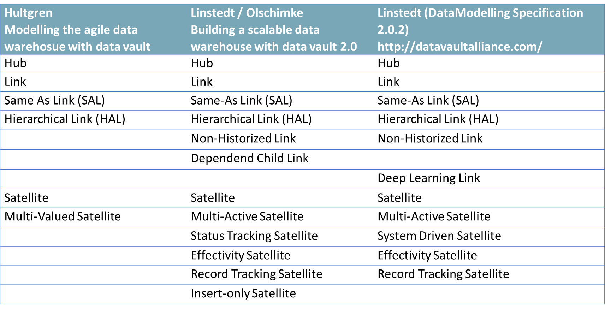
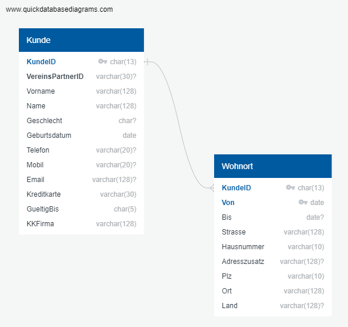
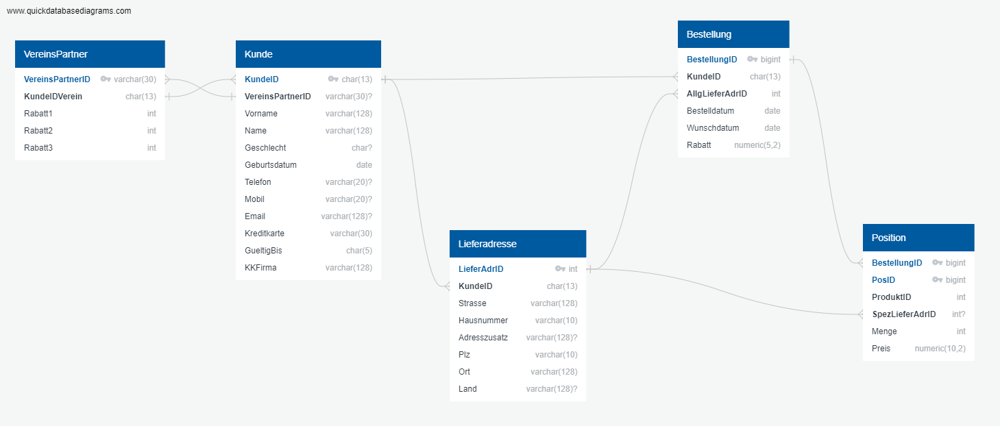
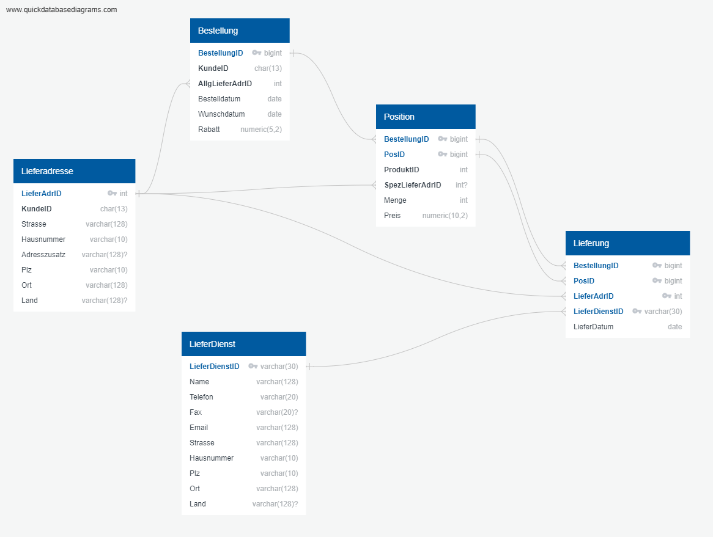
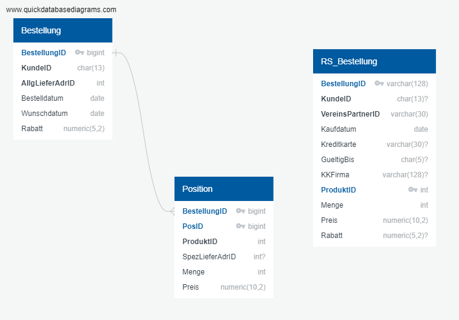

# Test cases with the seed and plant trade Willibald

Typical problems for a Data Vault Warehouse are stored in the data model and in the data. The cases range from Stage to Raw and Business Vault to Data Mart. 

## General functionality test of Raw Vault loading

The functionality of Stage and Raw Vault can be easily tested. To do this, simply restore the original data from the Raw Vault and compare it against the original delivery from the Stage. In this way, a test can ensure that all data has been loaded correctly.

## Test cases and pattern coverage in the data model

The data model contains typical cases/problems/challenges/patterns for building a Data Vault. This does not mean that you necessarily have to use the solution pattern suggested here. It is sufficient to solve the underlying situation in such a way that the loading tables can be recovered. Nevertheless, a broad coverage of the typical solution patterns is desirable. Here is an overview of the Data Vault Patterns in the order of their publication.

### Hierachical Link

The category to the product is a classic Hierarchical Link.

### Multi-Active Satellite

The entity Residences has the CustomerID (KundeID) and the StartingTime (Von) as primary keys and is therefore predestined for a multi-active satellite.

### Identifying Relationship and driving Key Patterns

The relationship between order and position cannot change. The key situation makes every change a deletion and a new creation.

For all other relationships, the relationships can and will change. The test cases are all implemented on the foreign key in the customer to the club partner. The following situations occur here:

- the foreign key is optional and therefore also NULL
- the foreign key changes between association partners
- the foreign key changes from valid to invalid and in some cases back to valid again.

### m:n table without own key

The table of deliveries (Lieferung) does not have its own primary key and usually only occurs once, as only successful deliveries are transmitted to the dwh.

This can be solved in several possible ways: keyed instance, transactional link, dependent child link, ...

### Integration of the order

We have 2 sources. These are to be loaded integrated into the Order and Item hubs. The primary keys of both systems are simply incremented. The roadshow has an additional 'RS' for safe differentiation.

One could argue that the integration should be in the Business Vault. Because the keys are not really the same, the sets are disjoint, it is much more secure. Those are all valid arguments. The point here is to present the ability to integrate early.

### Reference table

There is a list of reference values for the product type:

| Product Type | Name |
| ---------- | ----------- |
| 1 | Seed |
| 2 | seedling |
| 3 | Plant |
| 4 | Shrub |
| 5 | Tree |

## Test cases in the data

We get 3 complete deliveries. The evaluation of the data is done on these 3 deliveries and must provide the correct data in each case.

### Duplicates in the loading data

There are 2 types of duplicates in the product. In the first case it is an actual duplicate, all attributes are the same. In the second case, the attributes contradict each other. The data is in Testcases/Dubletten.sql:

- ProduktID 20 is the actual duplicate
- ProduktID 21 is a completely different product

Here we just want to see how this is handled.

### Records without Business Key

In the Delivery Service table (LieferDienst), there are records with valid values without a key. Again, just the question of how to handle this.

In Testcases/Missing-BusinessKey.sql there are two delivery services without a business key.

### Changes in customer data

A very simple test case, the data in the customer changes to a value in delivery 2 and gets the values from delivery 1 again in delivery 3. The test case is on the KundedID 107

### Deletions in the customer

There are cases in the customer where the customer was deleted in the second delivery and reappears in the third delivery. A test case is customer 70.

### Delivery addresses without customer

The first delivery contains delivery addresses for which there is no record with the same customer ID in the customer. The records have the CustomerID (KundeID) 999, 998 and 997.

### Deletions of orders

Purchase orders are relevant to the count and are deleted between deliveries.

Deleted deliveries:

- between 1 and 2 the purchase orderID (BestellungID) 99, 220 and 465.
- between 2 and 3 the orderID 1470 and the 1288.

### Changes in dimensions

The hierarchy of the product category changes completely with both deliveries. So we have 3 different product hierarchies.  These are to be displayed as as-what at the respective reporting time.

## Key figures as a result

Further transformations are necessary for the data mart.

### Creation of the fact table

The creation of the fact table with the key figures:

- Quantity
  The quantity of ordered products per product. This key figure is taken directly from the order item.
- Revenue
  The amount of money to be paid for the ordered product quantity. For this purpose, the quantity and price from the order item are multiplied and then the discount is deducted.
- Quantity in open orders
  The key figure quantity for orders that have not yet been fully delivered.
- Revenue in open orders
  The key figure revenue for orders that have not yet been fully delivered.
- Deviation between request and delivery date in days
  If each item has been delivered, the deviation is calculated from the order.requestdate and the last delivery.deliverydate. If the delivery was made before the requested date, the deviation is negative. Willibald wants to deliver on time, because even too early deliveries cause problems for the customer (care of seedlings).
- Orders without customers are always from the roadshow, therefore a dummy customer 'Roadshow' must be inserted.

### Necessary transformations through business rules 

1. standardise the orders of the association partners
   The orders of the roadshow are directly linked to the association partner. This must now be done for the orders of the association partner from the webshop. To do this, all orders for this customer are linked directly to the club partner using the club partner.customerIDclub.
2. assign roadshow orders to the customers 
   Using the credit card, the KKFirma and the GueltigBis, the relationships of the order to the customer are added.

### Historicised reference table for the dimension adherence to on-time delivery

A historicised reference table is still necessary for the data mart. It is started with the following values:

| Number of days from | Number of days to | Designation | Evaluation |
| :-------------: | :-------------: | -------------------------- | ---------------- |
| -1000000 | -5 | more than 5 days earlier | much too early |
| -5 | 0 | up to 5 days early | too early |
| 0 | 1 | on time | on time |
| 1 | 4 | up to 3 days late | late |
| 4 | 10 | 4 to 10 days late | significantly late |
| 10 | 1000000 | more than 10 days late | much too late |
| xxx | xxx | order active too long | error |
| zzz | zzz | sale, no delivery | irrelevant |

Then the value must change with the start of period 2:

| number of days from | number of days to | designation | evaluation |
| :-------------: | :-------------: | -------------------------- | ---------------- |
| -1000000 | -10 | more than 10 days too early | much too early |
| -10 | -4 | up to 10 days too early | significantly early |
| -4 | -1 | up to 3 days too early | too early |
| -1 | 1 | on time | on time |
| 1 | 4 | up to 3 days late | too late |
| 4 | 10 | up to 10 days late | significantly late |
| 10 | 1000000 | more than 10 days late | much too late |
| xxx | xxx | order active too long | error |
| zzz | zzz | sale, no delivery | irrelevant |

## Not tested

- Transfer of a load date timestamp from the input data
