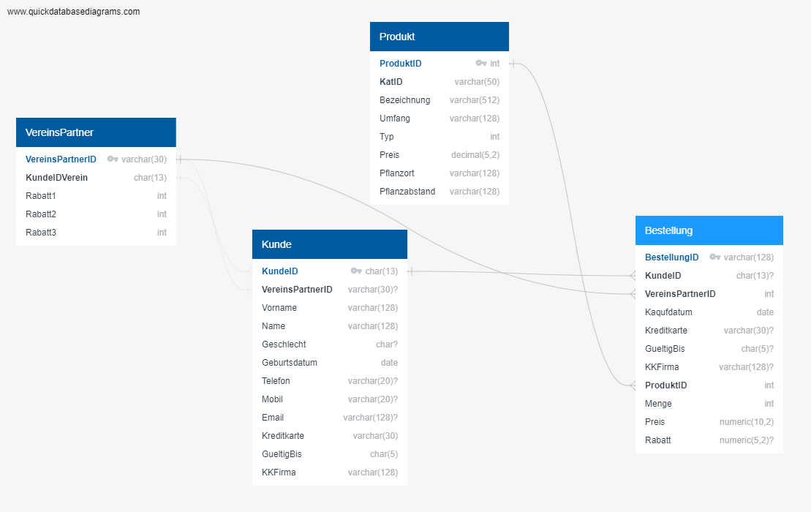
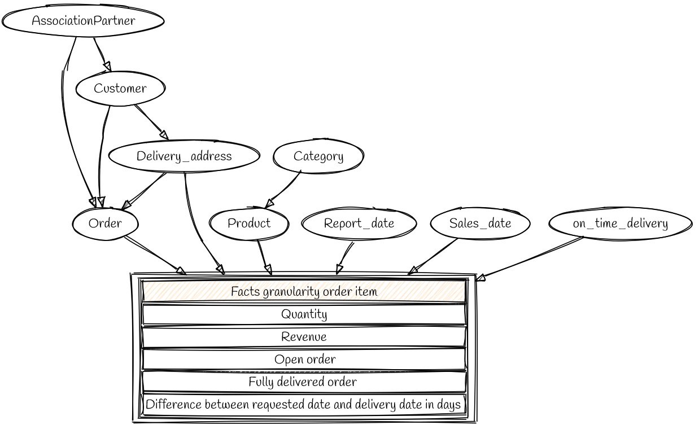

# The data model and data for the seed and plant trade Willibald

In this project the data and the data model for the fictitious company 'Samen und Pflanzenhandel Willibald' are located.

## The initial data

The company Willibald is a traditional house and trades with seeds and plants via the internet. In the past, the company sold exclusively via a catalogue. The catalogue was quickly terminated in 2000, a full 4 years after the webshop was opened. Willibald was the first plant supply shop on the internet and is still proud of it today.

When ordering via the website, one can enter a desired delivery date and this is currently met 90% of the time. Ordering is a very simple process, the customer selects his products and places his order. They can specify a delivery address for each order item.

Delivery is then made on the desired date if possible. Since the shipping of plants also includes shrubs and smaller trees, there are a number of delivery services that Willibald uses for delivery.

The shop's data model looks like this (the question marks behind the attributes mean that they are not mandatory attributes and the content can be NULL):

The VereinsPartner are the backbone of Willibald's marketing. Since its foundation in 1926, the Willibald seed and plant shop has offered special conditions and discounts for allotment and horticultural associations (these being the VereinsPartner). For each association there is a contact person among the customers. Each customer can register for his association and thus receive the association benefits. The senior boss of Willibald is convinced that this concept has brought the Willibald company through all crises.

Twice a year, the Willibald seed and plant trade goes on a roadshow. During this roadshow, the allotment and horticultural associations are visited with a truck full of seeds and plants. It will organise a small festivity and sell diligently. 2% of the turnover from this truck is donated directly to the association. For Willibald, this is a very good opportunity to get the seasonal goods to the customer before they expire. Since the beginning of the roadshow, no seasonal goods have had to be composted. 

From the roadshow, the data comes from the cash register system. Each turnover is clearly assigned to a club partner. The customer can enter his customer number. Unfortunately, only about 20% of the customers do this. Therefore, these turnovers cannot all be assigned to one customer.

The order ID (BestellungID) consists of 'RS' and a consecutive number. It is disjunctive to the order ID from the webshop.

The data model of the POS system (only order is delivered, product, customer and club partner are copies from the webshop):

The data is delivered in a table with the same structure as the Order table. The attributes OrderID (BestellungID), CustomerID (KundeID), ClubPartnerID (VereinsPartnerID), CreditCard (Kreditkarte), ValidTo (GueltigBis) and Credit Card Company (KKFirma) are redundant and serve as header information for the rest of the attributes (or actually the items). The header attributes are always the same for all items. So far, the data quality is correct.

By the way, the discount for the Roadshow is not on the order level, but on the order item level. More flexible discounts are needed for the roadshow in order to really get all seasonal goods to the customer.

## The evaluation

The desired report for Willibald includes the following key figures on a granular level:

- Quantity
  The quantity of ordered products per product. This key figure is taken directly from the order item.
- Revenue
  The amount of money to be paid for the ordered product quantity. For this purpose, the quantity and price from the order item are multiplied and then the discount is deducted.
- Open order
  A 1 to indicate briefly whether this order is still open.
- Completely delivered order
  A 1 to indicate briefly whether this order has already been delivered in full.
- Difference between request date and delivery date in days
  If each item has been delivered, the deviation is calculated from the order.requestdate and the last delivery.deliverydate. If the delivery was made before the requested date, the deviation is negative. Willibald wants to deliver on time, because too early deliveries also cause problems for the customer (care of seedlings).

This fact table then has the following dimensions:

Orders without customers are always from the roadshow, therefore a dummy customer 'Roadshow' must be inserted. Sales in the roadshow are always to be evaluated as on time.

### Necessary transformations

Transformations are necessary to map the source data to this data mart. First, the orders of the roadshow have to be mapped together with the orders and positions in two hubs in the Raw Vault.

Then the following business rules have to be applied to align the data:

1. Unify the orders of the association partners.
   The orders of the roadshow are directly linked to the association partner. This must now be done for the orders of the association partner from the webshop. To do this, all orders for this customer are linked directly to the club partner using the club partner.customerIDclub.
2. assign roadshow orders to the customers
   Using the credit card (Kreditkarte), the Credit Card Company (KKFirma) and the ValidTo (GueltigBis), the relationships from order to customer are added.

## Data model directory

Contains the diagrams and the description for the data models. The description is for the web modelling tool https://app.quickdatabasediagrams.com/#/. This generates both diagrams and DDL from these texts.

The evaluation is created with https://sketchviz.com/new. The 'auswertung en.txt' contains the necessary code for generating the image.

## Webshop directory

Contains the test data for the webshop in 3 complete deliveries. The test cases are described there in detail.

## Roadshow directory

Contains n deliveries from the Roadshow. The test cases are also described in more detail here.
